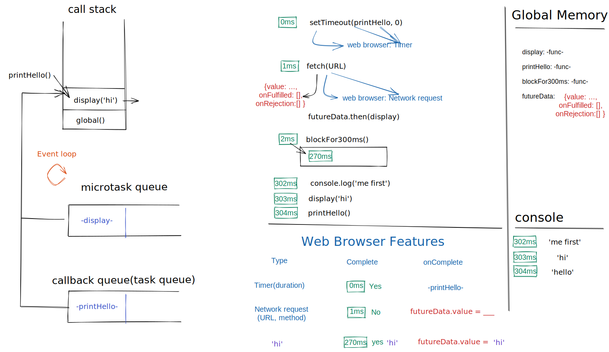

# ECMAScript

- [specification](https://262.ecma-international.org/)
- videos
  - [What the heck is the event loop anyway](https://www.youtube.com/watch?v=8aGhZQkoFbQ)
    - [javascript runtime simulation](http://latentflip.com/loupe)
  - [Jake Archibald: In The Loop](https://www.youtube.com/watch?v=cCOL7MC4Pl0)
- sites
  - [Concept explanation](https://www.javascripttutorial.net/)
  - [frontend hard mode](https://github.com/coffe1891/frontend-hard-mode-interview)
  - [stateofjs](https://2020.stateofjs.com/en-US/)
- books
  - [You Don't Know JS Yet ](https://github.com/getify/You-Dont-Know-JS)
  - [High Performance Browser Networking](https://hpbn.co/)
  - [HTTP: The Definitive Guide](https://www.oreilly.com/library/view/http-the-definitive/1565925092/)

- [ECMAScript](#ecmascript)
  - [Objects](#objects)
    - [`this`](#this)
    - [bind, call, apply](#bind-call-apply)
    - [Global context](#global-context)
    - [Function context](#function-context)
      - [Function invocation](#function-invocation)
      - [Method invocation](#method-invocation)
        - [Constructor invocation](#constructor-invocation)
      - [Indirect invocation](#indirect-invocation)
      - [Arrow functions](#arrow-functions)
    - [prototypes](#prototypes)
  - [Features](#features)
    - [Symbol](#symbol)
    - [Generator and Iterator](#generator-and-iterator)
    - [Async javascript](#async-javascript)
    - [Promise.all, Promise.race](#promiseall-promiserace)
    - [async/await](#asyncawait)
    - [Map](#map)
    - [WeakMap](#weakmap)
    - [Set](#set)
    - [WeakSet](#weakset)
    - [`BigInt`](#bigint)
    - [typed arrays](#typed-arrays)
    - [`slice` `splice` `split`](#slice-splice-split)
    - [Proxy](#proxy)
    - [With](#with)
    - [IIFE(Immediately Invoked Function Expression)](#iifeimmediately-invoked-function-expression)
  - [javascript-hard-parts](#javascript-hard-parts)
    - [core JavaScript engine](#core-javascript-engine)
    - [closure](#closure)
    - [Asynchronous and event loop](#asynchronous-and-event-loop)


## Objects

- [deep js foundations](https://static.frontendmasters.com/resources/2019-03-07-deep-javascript-v2/deep-js-foundations-v2.pdf)

### `this`

- [this](https://web.dev/javascript-this/)

- `this` === current execution context

- this: determination

```
1. Is the function called by new?
2. Is the function called by call() or apply()? Note: bind() effectively uses apply()
3. Is the function called on a context object?
4. DEFAULT: global object (except strict mode)
note: An arrow function doesn't define a this
```

- new: steps

```
const b = new A();
1. Create a brand new empty object
2.* Link that object to another object (b.__proto__ -> A.prototype)
3. Call function with this set to the new object
4. If function does not return an object, assume return of this
```

```js
const user = {
  name: 'john',
  whodis: function () {
    console.log(this); // user
  },
  butWhoAmI: () => console.log(this) // global
};
```

### bind, call, apply

```js
function showFace() {
  return this.face;
}
const user = {
  face: 'smile'
};

const showUserFace = showFace.bind(user);

console.log(showUserFace());
console.log(showFace.call(user, 1, 2, 3));
console.log(showFace.call(user, ...[1, 2, 3]));
console.log(showFace.apply(user, [1, 2, 3]));
```

### Global context

```js
console.log(this === globalThis); // true
```

### Function context

- Function invocation
- Method invocation
- Constructor invocation
- Indirect invocation

#### Function invocation

- non-strict mode

```js
function a() {
  console.log(this === globalThis);
}

a(); // true
```

- strict mode

```js
'use strict';
function a() {
  console.log(this);
}

a(); // undefine
```

#### Method invocation

```js
const Car = {
  brand: 'Toyota',
  getBrand: function () {
    return this.brand;
  }
};

console.log(Car.getBrand()); // Toyota

const car = Car.getBrand;

console.log(car()); // undefine
```

- to solve this problem, use `bind()` method of `Function.prototype`

```js
const b = Car.getBrand.bind();
```

- however it's able to bind other object to this

```js
const Car = {
  brand: 'Toyota',
  getBrand: function () {
    return this.brand;
  }
};

const Mobile = {
  brand: 'apple'
};

console.log(Car.getBrand());

const car = Car.getBrand.bind(Mobile);

console.log(car());
```

##### Constructor invocation

```js
function Car(brand) {
  this.brand = brand;
}

Car.prototype.getBrand = function () {
  return this.brand;
};

var car = new Car('Honda');
console.log(car.getBrand());
```

```js
var bmw = Car('BMW');
console.log(bmw.brand);
// => TypeError: Cannot read property 'brand' of undefined
```

```js
function Car(brand) {
  // if (!(this instanceof Car)) {
  //     throw Error('Must use the new operator to call the function');
  // }
  if (!new.target) {
    throw Error('Must use the new operator to call the function');
  }
  this.brand = brand;
}
```

#### Indirect invocation

```js
function getBrand(prefix) {
  console.log(prefix + this.brand);
}

let honda = {
  brand: 'Honda'
};
let audi = {
  brand: 'Audi'
};

getBrand.call(honda, "It's a "); // It's a Honda
getBrand.call(audi, "It's an "); // It's an Audi
```

```js
getBrand.apply(honda, ["It's a "]); // "It's a Honda"
getBrand.apply(audi, ["It's an "]); // "It's a Audi"
```

#### Arrow functions

```js
let getThis = () => this;
console.log(getThis() === window); // true
```

```js
function Car() {
  this.speed = 120;
}

Car.prototype.getSpeed = () => {
  return this.speed;
};

var car = new Car();
car.getSpeed(); // TypeError
```

### prototypes

`.prototype` only exist on function

```js
var a = function () {};
var b = [1, 2, 3];

console.log(a.prototype); //>> function(){}
console.log(b.prototype); //>> undefined
```

```js
var a = function () {};
var b = [1, 2, 3];

console.log(a.__proto__ === Function.prototype); //>> true
console.log(b.__proto__ === Array.prototype); //>> true
console.log(a.__proto__ === a.__proto__.constructor.prototype); // true
console.log(b.__proto__ === b.__proto__.constructor.prototype); //true

console.log(a.__proto__.__proto__ === Object.prototype); //>> true
console.log(b.__proto__.__proto__ === Object.prototype); //>> true

console.log(new Object().__proto__.__proto__); //>> null
console.log(Object.prototype.__proto__); //>> null
```

`__proto__` of a value is the prototype of constructor. //>> 一个对象的原型就是它的构造函数的 prototype 属性的值

```js
let person = {
  name: 'John Doe',
  greet: function () {
    return "Hi, I'm " + this.name;
  }
};

console.log(person instanceof Object); // true
console.log(person.toString()); // [object Object]
```

`person` no toString() method, so find in prototype chaine, then excute this `Object.prototype.toString()`

```js
let person = {
  name: 'John Doe',
  greet: function () {
    return "Hi, I'm " + this.name;
  }
};

let teacher = {};

teacher.__proto__ = person;

console.log(teacher.name);
console.log(Object.getPrototypeOf(teacher) === person); //true
```

```js
let person = {
  name: 'John Doe',
  greet: function () {
    return "Hi, I'm " + this.name;
  }
};

let teacher = Object.create(person);

console.log(Object.getPrototypeOf(teacher) === person); //true
```

`class`

```js
class A {}

A === A.prototype.constructor;
```

```js
class A {}

class B extends A {}

console.log(B.__proto___ === A); // true
B.prototype.__proto__ === A.prototype; //>> true
```

## Features

### Symbol

- `Symbol.iterator`

```js
const c = {
    [Symbol.iterator]:function() {
        let value = 1;
        return {
            next() {
                return {
                    value,
                    done: value++ > 3
                }
            }
        }
    }
}
for (let b of c) {
  console.log(b); // 1, 2, 3
}
```

- `Symbol.asyncIterator`

```js
const d = {
    [Symbol.asyncIterator]() {
        let value = 1;
        return {
            next() {
                return new Promise((resolve) => {
                    const result = {value, done: value++ >3};
                    setTimeout(() => resolve(result), 1000);
                    })
                }
            }
        }
    }
for await (let b of c) {
  console.log(b); // 1, 2, 3
}
```

- `Symbol.hasInstance`

```js
class A {}
class B {}

const a = new A();
const b = new B();

a instanceof A; // true
b instanceof A; // false

A[Symbol.hasInstance](a) // true

A.hasOwnProperty(Symbol.hasInstance) // false

A.__proto__.hasOwnProperty(Symbol.hasInstance) // true

Object.defineProperty(A, Symbol.hasInstance, {
    value: () => true;
    });

a instanceof A; // true
b instanceof A; // true
```

- `Symbol.isConcatSpreadable`

```js
const a = [1,2];
a[Symbol.isConcatSpreadable] // undefine
[].concat(1,2,[[3,4]],a);  // (5) [1, 2, Array(2), 1, 2]

a[Symbol.isConcatSpreadable] = false
[].concat(1,2,[[3,4]],a) // (4) [1, 2, Array(2), Array(2)]
```

- `Symbol.match replace split...`

```js
'abc'.replace(/a/, '1'); // 'Tbc'
/a/[Symbol.replace]('abc', 'T'); // 'Tbc'

'abcbebf'.split(/b/); // ['a', 'c', 'e', 'f']
/b/[Symbol.split]('abcbebf'); // ['a', 'c', 'e', 'f']

'abcbfbe'.split({ [Symbol.split]: () => 'Hello world' }); // 'Hello world'
```

- `Symbol.species`

```js
class MyArray extends Array {};
let arr = new MyArray();
arr.concat(1) // MyArray [1]

Object.defineProperty(MyArray, Symbol.species, { value: Array } );

arr.concat(1) // [1]
```

- `Symbol.toPrimitive`

```js
const obj1 = {
    toString() {
        return 'obj1';
    },
    valueOf() {
        return 1;
    }
};

const obj2 = {
    toString() {
        return 'obj2';
    }
};
const obj3 = {
    valueOf() {
        return 3;
    }
};

`${obj1}${obj2}${obj3}` // 'obj1obj2[object Object]'


const obj4 = Object.create(null);
obj4.valueOf = () => 'hello obj4';
`${obj4}` // 'hello obj4'

const obj5 = Object.create(null);
obj5.toString = () => '5';
`${obj5}` // '5'
+obj5 // 5
1+obj5 // '15'

const obj7 = {
  [Symbol.toPrimitive](hint) {
      if (hint === 'string') return 'obj7';
      return 7;
  }
}

+obj7 // 7
1 + obj7 // 8
`${obj7}` // 'obj7'
```

- `Symbol.toStringTag`

```js
const obj = {}

obj.toString() // '[object Object]'
obj.toString === Object.prototype.toString // true
Object.prototype.toString.call({}) // '[object Object]'
Object.prototype.toString.call(obj) // '[object Object]'

class B {}
const b = new B()

Object.prototype.toString(b) // '[object Object]'
Object.prototype.toString.call(b) // '[object Object]'
obj[Symbol.toStringTag] = 'WHATEVER'
Object.prototype.toString.call(obj) // '[object WHATEVER]'


class C {
    [Symbol.toStringTag] = 'CLASS C'
}
const c = new C()
Object.prototype.toString.call(c) // '[object CLASS C]'
```

- `Symbol.unscopables`

```js
const obj = {
a: 1,
b: 2
}
with (obj) {
     console.log(a,b)
}
// 1 2

obj[Symbol.unscopables] = { a: true }

with (obj) {
     console.log(a,b)
}
// VM4684:2 Uncaught ReferenceError: a is not defined
//     at <anonymous>:2:18
// (anonymous) @ VM4684:2
```


### Generator and Iterator

- loop though array object

```js
const person = { name: 'eriii', phone: '123-2312' };
for (const [key, value] of Object.entries(person)) {
  console.log(`key: ${key}is ${value}`);
}
// > "key: nameis eriii"
// > "key: phoneis 123-2312"
```

- iterator

```js
const names = ['john', 'joe', 'mm'];

for (const name in names) {
  console.log(name);
}
// 1 2 3

for (const name of names) {
  console.log(name);
}
// john joe mm

const iterator = names[Symbol.iterator]();
iterator.next(); // {value: "john", done: false}
iterator.next(); // {value: "joe", done: false}
iterator.next(); // {value: "mm", done: false}
iterator.next(); // {value: undefined, done: true}
```

```js
let i = [1, 2, 3, 4];

let iterator = i[Symbol.iterator]();

console.log(iterator.next());
console.log(iterator.next());
console.log(iterator.next());
console.log(iterator.next());
```

- generator

```js
function* generator() {
  yield 1;
  yield 2;
  yield 3;
  yield 4;
}

let iterator = generator();

console.log(iterator.next());
console.log(iterator.next());
console.log(iterator.next());
console.log(iterator.next());
console.log(iterator.next());
```

```js
const person = {name: 'eriii', phone: '123-2312'}
// person[Sy]

person[Symbol.iterator] = function* (){
  yield Object.keys(this)
}

[...person] // [['name', 'phone']]

for(const b of person){
  b // [name, phone]
}

person[Symbol.iterator] = function* (){
  yield* Object.keys(this)
}


[...person] // ['name', 'phone']

for(const b of person){
  b // name, phone
}
```

```js
function* generatorThings() {
  yield 'hello';
  const yo = yield 'hey';
  console.log(yo); //> yoyo
  yield 'hi';
  return 'return';
}

const g = generatorThings();

g.next(); // > {value: "hello", done: false}
g.next('yo'); // > {value: "hey", done: false}
g.next('yoyo'); // > {value: "hi", done: false}
const m = g.next(); // > {value: undefined, done: true}
m.done;
```

- use generator to create own Object.entries function

```js

const person = { name: 'eriii', phone: '123-2312' };

function* entries(obj) {
  const keys = Object.keys(obj)
  for (const key of keys){
    yield [key, obj[key]]
  }
}

for(const [key, value] of entries(person)){
  console.log(`key: ${key} is ${value}`);
}
// key: name is eriii
// key: phone is 123-2312
```

### Async javascript

- Callback

```js
let greeting = (name) => cosnole.log(`Hello ${name}!`);

const userInfo = (firstName, lastName, callback) => {
  const fullName = `${firstName} ${lastName}`;
  callback(fullName);
};

userInfo('John', 'Doe', greeting);
```

- Promise

```js
const hasMeeting = false;
const meeting = new Promise((resolve, reject) => {
  if (!hasMeeting) {
    const meetingDetails = {
      name: 'Maketing Meeting',
      location: 'Skype',
      time: '1:00 pm'
    };
    resolve(meetingDetails);
  } else {
    reject(new Error('Meeting already scheduled'));
  }
});

meeting.then((res) => console.log(res)).catch((err) => console.error(err));
```

- chain promise

```js
const addToCalendar = (meetingDetails) => {
  const calendar = `${meetingDetails.name} is scheduled at ${meetingDetails.time} on ${meetingDetails.location}`;
  return Promise.resolve(calendar);
};

meeting
  .then(addToCalendar)
  .then((res) => console.log(res))
  .catch((err) => console.error(err));
```

### Promise.all, Promise.race

```js
const promise1 = Promise.resolve('Promise 1 complete');
const promise2 = Promise.resolve('Promise 2 complete');

promise1.then((res) => console.log(res));
promise2.then((res) => console.log(res));
// Promise 1 complete
// Promise 2 complete

// excute when all promise fulfilled
Promise.all([promise1, promise2]).then((res) => console.log(res));
// ["Promise 1 complete", "Promise 2 complete"]

// excute when first promise fulfilled
Promise.race([promise1, promise2]).then((res) => console.log(res));
// Promise 1 complete
```

### async/await

```js
const myMeeting = async () => {
  try {
    const meetingDetails = await meeting;
    const message = await addToCalendar(meetingDetails);
    console.log(message);
  } catch (err) {
    console.log(err.message);
  }
};
myMeeting();
```


### Map

The Map object holds key-value pairs and **remembers** the original insertion order of the keys. Any value (both **objects** and primitive values) may be used as either a key or a value.

```js
const a = {};
const b = { num: 1 };

const map = new Map();

map.set(a, 'a').set(b, 'b').set(a, 'c');
// map.delete(b);
// map.get(a)

for (let [key, value] of map.entries()) {
  console.log(key, value);
}

const arr = [...map]; // convert to array

console.log(map);
```

### WeakMap

> [info](https://javascript.info/weakmap-weakset)

1. The first difference from Map is that WeakMap keys must be **objects**, not primitive values
2. if we use an object as the key in it, and there are no other references to that object – it will be removed from memory (and from the map) automatically
3. WeakMap does not support iteration and methods keys(), values(), entries(), so there’s no way to get all keys or values from it.

```js
let weakMap = new WeakMap();

let obj = {};

weakMap.set(obj, "ok"); // works fine (object key)

// can't use a string as the key
weakMap.set("test", "Whoops"); // Error, because "test" is not an object
```


```js
let john = { name: "John" };

let weakMap = new WeakMap();
weakMap.set(john, "...");

john = null; // overwrite the reference

// john is removed from memory!
```

### Set

- Set

1. The Set object lets you store **unique** values of any type, whether primitive values or object references.

2. Set objects are collections of values. You can iterate through the elements of a set in **insertion order**. A value in the Set may **only occur once**; it is unique in the Set's collection.

```js
const set = new Set([1, 2, 4]);
set.add(1).add(2);
// set has no order
for (let val of set) {
  console.log(val);
}
console.log(set);
```

```js
const arr = [1, 2, 2, 3];
const newArr = [...new Set(arr)]; //[1,2,3]
const newArr = [Array.from(new Set[arr]())]; //[1,2,3]
```

### WeakSet

> [info](https://javascript.info/weakmap-weakset)

1. It is analogous to `Set`, but we may only add objects to `WeakSet` (not primitives).
2. An object exists in the set while it is reachable from somewhere else.
3. Like `Set`, it supports `add`, `has` and `delete`, but not `size`, `keys()` and no iterations.

```js
const ws = new WeakSet([{ a: 1 }, { b: 2 }]);

for (let val of ws) {
  console.log(val); // ERROR => WeakSet is not iterable.
}
```

### `BigInt`

```js
let a = BigInt('0x' + 'FFF');
let b = BigInt('0b'+ '11010');
let c = BigInt(1235)

Number(a);
parseInt(b);
b.toString(2);
```

### typed arrays

[typed arrays](https://developer.mozilla.org/en-US/docs/Web/JavaScript/Typed_arrays)

```js
let buffer = new ArrayBuffer(24);

// ... read the data into the buffer ...

let idView = new Uint32Array(buffer, 0, 1);
let usernameView = new Uint8Array(buffer, 4, 16);
let amountDueView = new Float32Array(buffer, 20, 1);
```


### `slice` `splice` `split`

- `slice()`

  - Copies elements from an array
  - Returns them as a new array
  - Doesn’t change the original array
  - Starts slicing from … until given index: array.slice (from, until)
  - Slice doesn’t include “until” index parameter
  - Can be used both for arrays and strings

- `Splice()`

  - Used for adding/removing elements from array
  - Returns an array of removed elements
  - Changes the array
  - For adding elements: array.splice (index, number of elements, element)
  - For removing elements: array.splice (index, number of elements)
  - Can only be used for arrays

- `Split()`

  - Divides a string into substrings
  - Returns them in an array
  - Takes 2 parameters, both are optional: string.split(separator, limit)
  - Doesn’t change the original string
  - Can only be used for strings

### Proxy

- [MDN](https://developer.mozilla.org/en-US/docs/Web/JavaScript/Reference/Global_Objects/Proxy)

> The Proxy object enables you to create a proxy for another object, which can intercept and redefine fundamental operations
> for that object.

```js
let data = { count: 1 };

let proxy = new Proxy(data, {
  get(target, key) {
    console.log('getting...');
    return target[key];
  },
  set(target, key, value) {
    console.log('setting...');
    target[key] = value;
    return true;
  }
});
```

### With

- [MDN](https://developer.mozilla.org/en-US/docs/Web/JavaScript/Reference/Statements/with)
  > The with statement extends the scope chain for a statement.

```js
let person = {
  name: 'JANE',
  age: 25
};

let expression = '`${name} is ${age} years old`';

with (person) {
  console.log(eval(expression));
}
```

### IIFE(Immediately Invoked Function Expression)

- normal function

```js
function multiply(a, b) {
  return a * b;
}
console.log(mutiply(2, 5));
```

- IIFE function

```js
(function (a, b) {
  return a * b;
})(2, 5);
```

- IIFE arrow function

```js
((a, b) => {
  return a * b;
})(2, 5);
```

- Variable scope with IIFE

```js
var name = 'JOE'(function (a, b) {
  var name = 'BOB';
  console.log(name); // BOB
})(2, 5);
console.log(name); // JOE
```

- Compare with normal situation and es6

```js
var name = 'JOE';
{
  var name = 'BOB';
  console.log(name); // BOB
}
console.log(name); // BOB
```

```js
let name = 'JOE';
{
  let name = 'BOB';
  console.log(name); // BOB
}
console.log(name); // JOE
```


## javascript-hard-parts

### core JavaScript engine

- Thread of execution
- Memory/variable environment
- Call stack

### closure

```js
function outer (){
 let counter = 0;
 function incrementCounter (){ // The ‘backpack’ (or ‘closure’) of live data is attached incrementCounter (then to myNewFunction) through a hidden property known as [[scope]] which persists when the inner function is returned out
 counter ++;
 }
 return incrementCounter;
}

const myNewFunction = outer();
myNewFunction();
myNewFunction();

// Let’s run outer again
const anotherFunction = outer(); // new incrementCounter function was created in a new execution context and therefore has a brand new independent backpack
anotherFunction();
anotherFunction();
```

> Closure gives our functions persistent memories and entirely new toolkit for writing professional code

- *Helper functions*: Everyday professional helper functions like ‘once’ and ‘memoize’
- *Iterators and generators*: Which use lexical scoping and closure to achieve the most contemporary patterns for handling data in JavaScript
- *Module pattern*: Preserve state for the life of an application without polluting the global namespace
- *Asynchronous JavaScript*: Callbacks and Promises rely on closure to persist state in an asynchronous environment

### Asynchronous and event loop

- [Tasks, microtasks, queues and schedules](https://jakearchibald.com/2015/tasks-microtasks-queues-and-schedules/)

Our core JavaScript engine has 3 main parts:
  - Thread of execution
  - Memory/variable environment
  - Call stack

We need to add some new components:
  - Web Browser APIs/Node background APIs
  - Promises
  - Event loop, Callback/Task queue and micro task queue

- ES5 callback
  - Problems
    - Our response data is only available in the callback function - Callback hell
    - Maybe it feels a little odd to think of passing a function into another function only for it to run much later
  - Benefits
    - Super explicit once you understand how it works under-the-hood

```js
function printHello(){ console.log("Hello"); }
function blockFor1Sec(){ /*blocks in the JavaScript thread for 1 sec */}

function blockFor1Sec(){
  for (let i = 0; i < 1000000000;i++){
    const b = [i];
  }
}
setTimeout(printHello,0);
blockFor1Sec()
console.log("Me first!");

// ------ console
// 1 second later
// Me first!
// Hello
```

- ES6 promise
  - Using two-pronged ‘facade’ functions that both:
    - Initiate background web browser work and Return a placeholder object (promise) immediately in JavaScript

```js
function display(data){
 console.log(data)
}
const futureData = fetch('https://twitter.com/user/tweets/1')
// what does fetch do under the hood
// 1. javascript side: create an object {value:..., onFulfilled: []}, assign to futureData, then(display) called push into onFulfilled array
// 2. web browser side: network request             complete?          onCompletion
//                           | URL                    | 0ms no             |
//                           | http method            | 280ms yes 'hi'     | futureData.value = API.data, when future.value updates, trigger onFulfilled array functions -> display('hi')
futureData.then(display); // storage function to run later

console.log("Me first!");
```

- we need to know how our promise-deferred functionality gets back into JavaScript to be run

```js
function display(data){console.log(data); console.log('hi');}
function printHello(){console.log("Hello");}
function blockFor300ms(){ // 800ms
for (let i = 0; i < 1000000000;i++){
    const b = [i];
  }
}
setTimeout(printHello, 0);
const futureData = fetch('https://jsonplaceholder.typicode.com/todos/1')
futureData.then(display)
blockFor300ms()
console.log("Me first!");
```

```js
function display(data){console.log(data); console.log('hi');}
function printHello(){console.log("Hello");}
function blockFor300ms(){ // 800ms
for (let i = 0; i < 1000000000;i++){
    const b = [i];
  }
}
setTimeout(printHello, 0);
const futureData = new Promise(resolve => { resolve('hi') })

futureData.then(display)
 queueMicrotask(() => {
      console.log('hihi')
    });
blockFor300ms()
console.log("Me first!");
```

- Problems
  - 99% of developers have no idea how they’re working under the hood
  - Debugging becomes super-hard as a result
- Benefits
  - Cleaner readable style with pseudo-synchronous style code
  - Nice error handling process



- We have rules for the execution of our asynchronously delayed code
  - Hold promise-deferred functions in a microtask queue and callback function in a task queue (Callback queue) when the Web Browser Feature (API) finishes
  - Add the function to the Call stack (i.e. run the function) when:
    - Call stack is empty & all global code run (Have the Event Loop check this condition)
    - Prioritize functions in the microtask queue over the Callback queue

- Promises, Web APIs, the Callback & Microtask Queues and Event loop enable:
  - *Non-blocking applications*: This means we don’t have to wait in the single thread and don’t block further code from running
  - *However long it takes*: We cannot predict when our Browser feature’s work will finish so we let JS handle automatically running the function on its completion
  - *Web applications*: Asynchronous JavaScript is the backbone of the modern web - letting us build fast 'non-blocking' applications