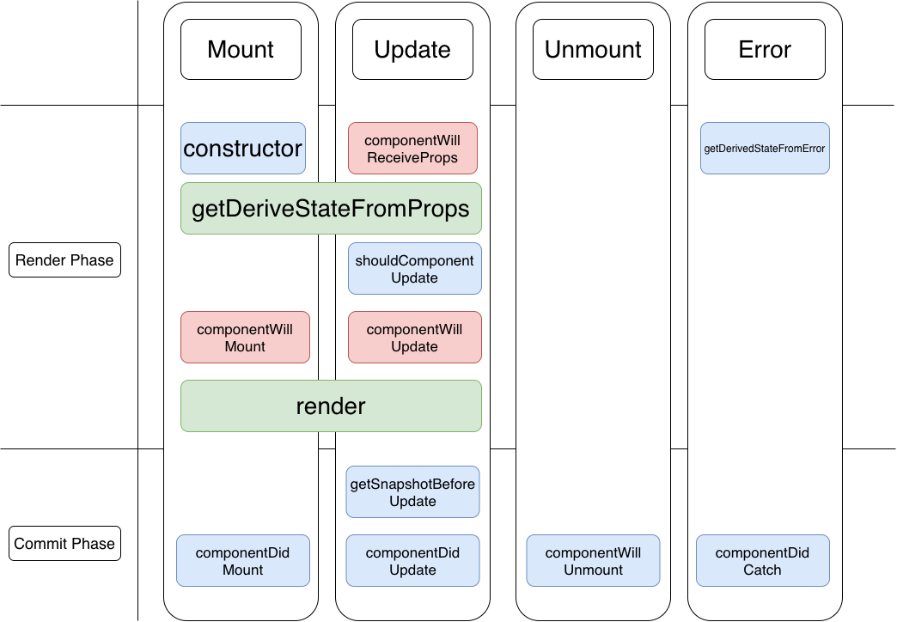

## React

- [build-your-own-react](https://pomb.us/build-your-own-react/)
- [react source code](https://react.iamkasong.com/)

## Simplest implemention of redux

```js
function createStore(reducer) {
  let state = { state: 1 };

  let listeners = [];

  function dispatch(action) {
    state = reducer(state, action);

    for (let i = 0; i < listeners.length; i++) {
      listeners[i]();
    }
  }

  function subscribe(listener) {
    listeners.push(listener);
  }

  function getState() {
    return state;
  }

  return {
    dispatch,
    getState,
    subscribe
  };
}
const reducer = (state, action) => {
  switch (action.type) {
    case 'action':
      return { ...state, state: action.payload };
    default:
      break;
  }
};

const store = createStore(reducer);

store.subscribe(() => {
  console.log('Store changed!');
});

store.dispatch({ type: 'action', payload: 2 });

const result = store.getState();

console.log(result);
```

## Get query paramater with react router

```tsx
const useQuery = () => {
  const location = useLocation();
  return new URLSearchParams(location.search);
};

const query = useQuery();

query.get('id');
```

## React helmet and default props value

```tsx
import React from 'react';
import { Helmet } from 'react-helmet';

interface MetaProps {
  title?: string;
  description?: string;
  keywords?: string;
}

export const Meta: React.FC<MetaProps> = ({ title, description, keywords }) => {
  return (
    <Helmet>
      <title>{title}</title>
      <meta name="description" content={description} />
      <meta name="keywords" content={keywords} />
    </Helmet>
  );
};

Meta.defaultProps = {
  title: 'Welcome to | Home',
  description: 'We sell the best products for cheap',
  keywords: 'electorincs cheap cool'
};
```

## Switch case usecase in JSX

```tsx
const Notification = ({ text, status }) => {
  const types = ['info', 'warning', 'error'];
  return (
    <div>
      {types.map((type, index) => (
        <div key={type}>
          {(() => {
            switch (status) {
              case 'info':
                return <Info text={text} />;
              case 'warning':
                return <Warning text={text} />;
              case 'error':
                return <Error text={text} />;
              default:
                return null;
            }
          })()}
        </div>
      ))}
    </div>
  );
};
```

## React Query

```tsx
const NewAxios = axios.create({
  baseURL: 'host',
  headers: { 'X-API-SECRET': 'xxx' }
});

const getPosts = async () => {
  const params = {
    filters: 'category[equals]creatures',
    fields: 'id,name',
    limit: 3
  };
  const { data } = await NewAxios.get<{ contents: Post[] }>('/posts', { params });
  return data.contents;
};

export const usePostsQuery = (): QueryObserverResult<Motif[]> => {
  return useQuery<Post[], Error>('posts', getPosts);
};
```

## Nextjs

- Static Generation(SSG) - prerendering

> fetch data at build time
> update need rebuild
> pages that not change often

`/pages/cars/[id].tsx`

```tsx
import { useRouter } from 'next/router';
import Head from 'next/head';

export default function Car({ car }) {
  const router = useRouter();
  const { id } = router.query;

  return (
    <>
      <Head>
        <title>{car.color}</title>
      </Head>
      <h1>Hello {id}</h1>
    </>
  );
}

export async function getStaticProps({ params }) {
  const req = await fetch(`/api/${params.id}`);
  const data = await req.json();

  return {
    props: { car: data }
  };
}

export async function getStaticPaths() {
  const req = await fetch('/apis');
  const data = await req.json();

  const paths = data.map((car) => {
    return { params: { id: car } };
  });
}
```

- Server Side Rendering(SSR)

> fetch data at each request time
> pages that change often

```tsx
export async function getServerSideProps() {
  const req = await fetch('/api');
  const car = await req.json();

  return {
    props: { car }
  };
}

export default function Car({ car }) {
  return <h1>{car.maker}</h1>;
}
```

- Incrementail static regeneration(ISR)

> re-generate single pages in the background

```tsx
export async function getStaticProps() {
  // fetch ...
  return {
    props: { car },
    revalidate: 30
  };
}
```

## Compound Components

### React.Children, React.cloneElement

```jsx
const Checkbox = ({ children }) => {
  const [checkbox, setCheckbox] = useState(false);
  const clonedChildren = React.Children.map(children, (child) => {
    if (typeof child.type === 'string') {
      throw new Error(
        `<${child.type} /> DOM element is not allowed inside <Checkbox /> component.`
      );
    }
    // if (typeof child.type !== Label && typeof child.type !== CheckboxInput) {
    //   throw new Error(`<${child.type} /> is not allowed custom component.`);
    // }

    const clone = React.cloneElement(child, {
      checkbox,
      setCheckbox
    });
    return clone;
  });
  return clonedChildren;
};
const CheckboxInput = ({ checkbox, setCheckbox }) => {
  const [_checkbox, _setCheckbox] = useState(!!checkbox);

  useEffect(() => {
    if (!setCheckbox)
      console.warn('CheckboxInput should be called inside Checkbox for max benefit');
  }, [setCheckbox]);
  return (
    <input
      type="checkbox"
      checked={_checkbox}
      onChange={(e) => {
        _setCheckbox((val) => !val);
        if (setCheckbox) setCheckbox((val) => !val);
      }/}
    />
  );
};
const Label = ({ children, setCheckbox }) => {
  if (!setCheckbox) {
    throw new Error('No <Label /> without <Checkbox />');
  }
  return <div onClick={() => setCheckbox((val) => !val)}>{children}</div>;
};

const App = () => {
  return (
    <div className="App">
      <Title />
      <Checkbox>
        <Label>Email</Label>
        <CheckboxInput />
      </Checkbox>
      {/* <CheckboxInput /> */}
    </div>
  );
};
```

### Context API

```jsx
const CheckboxInterface = createContext(null);

const Checkbox = ({ children }) => {
  const [checkbox, setCheckbox] = useState(false);

  return (
    <CheckboxInterface.Provider value={/{ checkbox, setCheckbox }/}>
      {children}
    </CheckboxInterface.Provider>
  );
};

const CheckboxInput = () => {
  const { checkbox, setCheckbox } = useContext(CheckboxInterface);
  useEffect(() => {
    if (!setCheckbox)
      console.warn('CheckboxInput should be called inside Checkbox for max benefit');
  }, [setCheckbox]);
  return (
    <input
      type="checkbox"
      checked={checkbox}
      onChange={(e) => {
        if (setCheckbox) setCheckbox((val) => !val);
      }/}
    />
  );
};

const Label = ({ children }) => {
  const { setCheckbox } = useContext(CheckboxInterface);
  if (!setCheckbox) {
    throw new Error('No <Label /> without <Checkbox />');
  }
  return <div onClick={() => setCheckbox((val) => !val)}>{children}</div>;
};

const Title = () => <div>HELLO</div>;

const App = () => {
  return (
    <div className="App">
      <Title />
      <Checkbox>
        <Label>Email</Label>
        <CheckboxInput />
      </Checkbox>
      {/* <CheckboxInput /> */}
    </div>
  );
};
```

## React17 lifecycle

